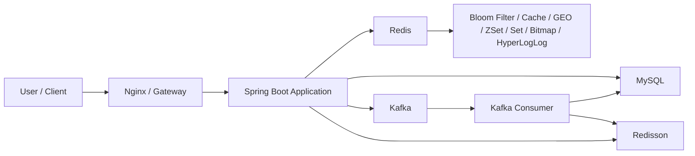
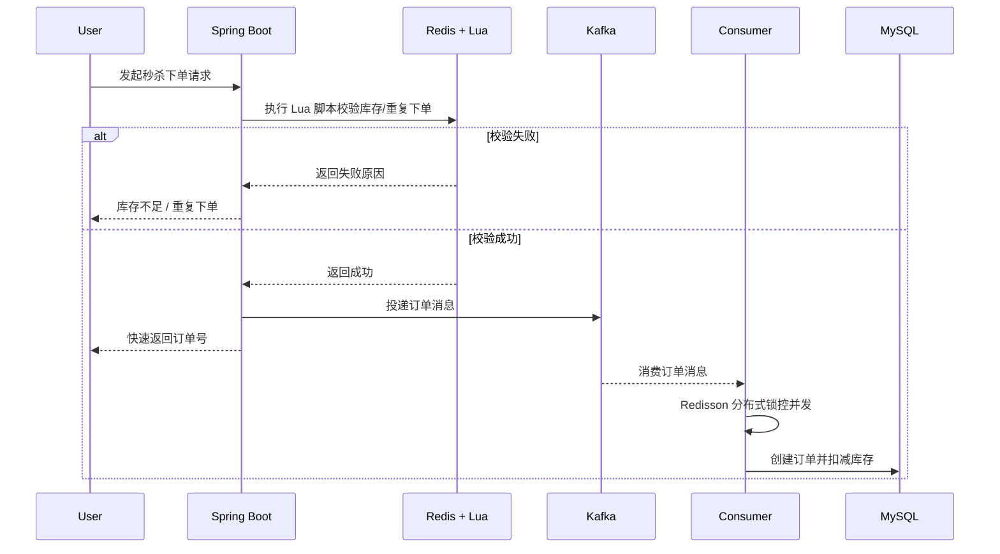

# 人间食记

一个基于 Spring Boot 的本地生活服务平台后端项目，聚焦商户查询、优惠券秒杀、点赞关注、签到统计、附近商户检索等核心业务场景。

## 项目简介

人间食记围绕高并发下的本地生活服务场景进行设计与实现，重点解决了登录态共享、商户缓存、秒杀下单、分布式并发控制等问题。项目在 Redis 场景化应用、高并发秒杀链路优化、异步削峰等方向做了完整落地，适合作为后端高并发项目实践展示。

## 技术栈

- Spring Boot
- MyBatis-Plus
- Redis
- Redisson
- MySQL
- Kafka
- Lua

## 核心功能

- 短信登录与登录态刷新
- 商户详情查询与缓存优化
- 优惠券秒杀与异步下单
- 点赞、关注、共同关注
- 用户签到统计
- 附近商户检索

## 架构总览



## 项目亮点

- **基于 Redis 存储登录态，结合拦截器实现集群环境下的登录校验与权限刷新，解决多节点 Session 共享问题。**
- **采用 Cache Aside 模式实现商户缓存，结合布隆过滤器、逻辑过期、异步缓存重建等策略，优化缓存穿透与热点数据访问问题。**
- **面向秒杀场景，使用 Redis + Lua 实现库存校验与重复下单的原子预检，在高并发下提前完成资格判断，减少数据库压力。**
- **使用 Redisson 分布式锁按用户维度控制下单并发，保证集群环境下一人一单，并结合乐观锁防止库存超卖。**
- **基于 Kafka 实现异步下单，将订单落库与库存扣减逻辑从请求链路中解耦，完成削峰填谷，提升秒杀接口吞吐量与响应速度。**
- **使用 Redis GEO 实现附近商户检索，使用 ZSet 实现点赞排序 / 最近点赞列表，使用 Set 实现关注与共同关注，使用 Bitmap / HyperLogLog 支撑签到统计与 UV 计数。**

## 秒杀下单流程



## 缓存与数据结构设计

| 场景 | Redis 结构 | 作用 |
| --- | --- | --- |
| 登录态 | Hash / String | 存储用户登录信息与 Token，支持集群共享 |
| 商户缓存 | String + 逻辑过期 | 缓存商户详情，降低数据库查询压力 |
| 非法商户 ID 拦截 | Bloom Filter | 预判数据是否存在，减少缓存穿透 |
| 秒杀库存预检 | Lua + String + Set | 原子校验库存和一人一单 |
| 附近商户 | GEO | 基于经纬度完成附近商户检索 |
| 点赞排序 | ZSet | 存储点赞时间戳，实现最近点赞列表 |
| 关注关系 | Set | 快速判断关注状态与共同关注 |
| 用户签到 | Bitmap | 节省存储空间，统计连续签到 |
| UV 统计 | HyperLogLog | 近似去重统计访问用户数 |

## 关键实现

### 1. 商户缓存优化

- 查询商户前先通过布隆过滤器校验商户 ID，提前拦截非法请求。
- 热点商户缓存采用逻辑过期方案，避免大量请求同时击穿数据库。
- 缓存重建放到异步线程执行，兼顾吞吐量与可用性。

### 2. 秒杀下单链路

- 使用 Lua 脚本在 Redis 中完成库存判断、一人一单判断与原子扣减。
- 秒杀资格校验通过后立即返回订单号，并将订单消息投递到 Kafka。
- 消费端异步执行订单落库与库存扣减，缩短请求链路耗时。

### 3. 分布式并发控制

- 基于 Redisson 分布式锁按用户粒度串行化下单行为。
- 数据库层结合乐观锁控制库存扣减，避免超卖。

## 代码结构

- `src/main/java/com/hmdp/service/impl/ShopServiceImpl.java`：商户缓存核心实现
- `src/main/java/com/hmdp/service/impl/VoucherOrderServiceImpl.java`：秒杀下单核心实现
- `src/main/java/com/hmdp/listener/SeckillVoucherKafkaListener.java`：Kafka 异步订单消费
- `src/main/java/com/hmdp/config/ShopBloomFilterInitializer.java`：店铺布隆过滤器初始化
- `src/main/resources/seckill.lua`：秒杀资格原子校验脚本
- `src/main/resources/db/hmdp.sql`：数据库初始化脚本

## 环境依赖

- JDK 8
- Maven 3.6+
- MySQL 8
- Redis 6+
- Kafka 3+

## 快速启动

### 1. 启动 MySQL

```bash
docker run -d \
  --name renjian-mysql \
  -p 3306:3306 \
  -e MYSQL_ROOT_PASSWORD=290390 \
  -e MYSQL_DATABASE=dingping \
  mysql:8.0
```

导入初始化脚本：

```bash
docker exec -i renjian-mysql mysql -uroot -p290390 dingping < src/main/resources/db/hmdp.sql
```

### 2. 启动 Redis

```bash
docker run -d \
  --name renjian-redis \
  -p 6379:6379 \
  redis:6.2
```

### 3. 启动 Kafka

```bash
docker run -d \
  --name renjian-kafka \
  -p 9092:9092 \
  -e KAFKA_CFG_NODE_ID=1 \
  -e KAFKA_CFG_PROCESS_ROLES=broker,controller \
  -e KAFKA_CFG_CONTROLLER_LISTENER_NAMES=CONTROLLER \
  -e KAFKA_CFG_LISTENERS=PLAINTEXT://:9092,CONTROLLER://:9093 \
  -e KAFKA_CFG_ADVERTISED_LISTENERS=PLAINTEXT://localhost:9092 \
  -e KAFKA_CFG_LISTENER_SECURITY_PROTOCOL_MAP=PLAINTEXT:PLAINTEXT,CONTROLLER:PLAINTEXT \
  -e KAFKA_CFG_CONTROLLER_QUORUM_VOTERS=1@127.0.0.1:9093 \
  -e KAFKA_CFG_AUTO_CREATE_TOPICS_ENABLE=true \
  bitnami/kafka:3.7
```

如未开启自动创建 Topic，可手动执行：

```bash
docker exec -it renjian-kafka kafka-topics.sh \
  --create \
  --topic seckill.voucher.order \
  --bootstrap-server localhost:9092 \
  --partitions 1 \
  --replication-factor 1
```

### 4. 启动项目

```bash
mvn clean package
mvn spring-boot:run
```
