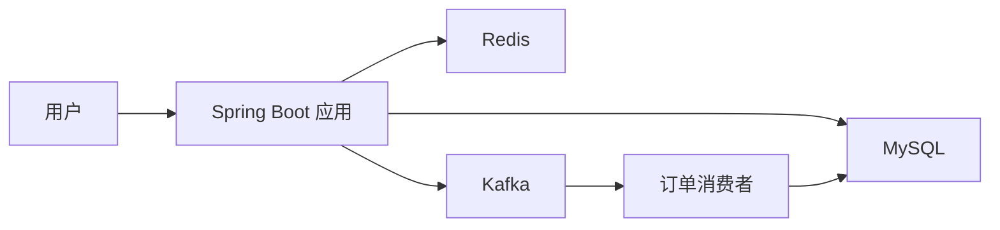
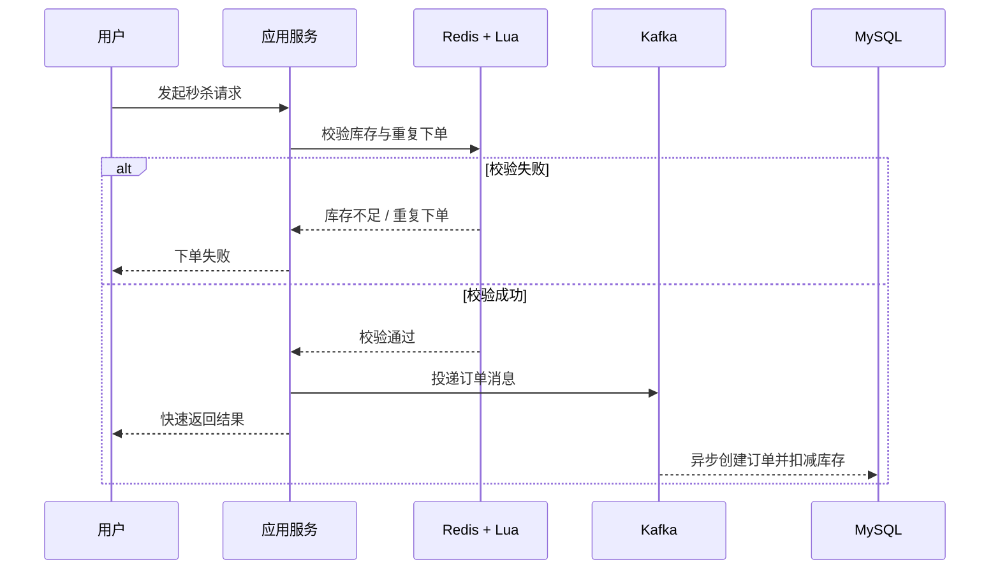

# 人间食记

一个面向本地生活场景的 Spring Boot 后端项目，围绕商户查询、缓存优化、优惠券秒杀、订单创建与用户互动等核心业务进行设计与实现。

## 项目亮点

- 基于 `Redis + 双拦截器` 实现登录态校验与自动续期，支持分布式场景下的登录状态共享。
- 围绕商户详情查询设计缓存方案，通过逻辑过期、布隆过滤器等手段降低缓存穿透与热点回源压力。
- 针对优惠券秒杀场景，使用 `Redis + Lua` 完成库存预检与一人一单校验，将高并发校验前移到缓存层。
- 使用 `Kafka` 将秒杀下单请求异步化，缩短主链路响应时间，并结合 `Redisson` 与乐观锁减少超卖风险。
- 基于 `GEO / ZSet / Bitmap / Set` 等 Redis 数据结构实现附近商户、点赞排行、共同关注、签到统计等功能。

## 核心功能

- 手机号验证码登录
- 商户列表 / 商户详情查询
- 商户缓存优化
- 优惠券秒杀下单
- 点赞、关注、共同关注
- 用户签到与签到统计
- 附近商户检索

## 技术栈

- `Spring Boot`
- `MyBatis-Plus`
- `MySQL`
- `Redis`
- `Redisson`
- `Kafka`
- `Lua`

## 业务架构



## 秒杀链路



## 关键设计

### 1. 登录与权限校验

- 使用 Redis 存储登录态，避免多节点场景下 Session 不共享问题。
- 通过双拦截器实现登录态刷新与用户身份校验，减少重复认证开销。

### 2. 商户缓存优化

- 查询前先使用布隆过滤器预判商户是否存在，减少无效请求穿透数据库。
- 热点商户采用逻辑过期方案，兼顾缓存命中率与系统可用性。
- 缓存重建异步化，减轻热点数据失效时的瞬时数据库压力。

### 3. 秒杀与下单控制

- 通过 Lua 脚本在 Redis 中原子完成库存校验与一人一单判断。
- 秒杀请求通过 Kafka 异步削峰，减少接口阻塞时间。
- 结合 Redisson 分布式锁和数据库乐观锁降低超卖风险。

## Redis 典型应用

| 场景 | 实现方式 | 作用 |
| --- | --- | --- |
| 登录态 | Hash / String | 存储用户登录信息，支持自动续期 |
| 商户缓存 | String + 逻辑过期 | 降低商户详情查询回源 |
| 秒杀资格校验 | Lua + String + Set | 校验库存、一人一单 |
| 附近商户 | GEO | 实现地理位置检索 |
| 点赞列表 | ZSet | 获取最近点赞用户 |
| 共同关注 | Set | 快速计算交集 |
| 签到统计 | Bitmap | 统计连续签到 |

## 项目结构

- `src/main/java/com/hmdp/service/impl/ShopServiceImpl.java`：商户缓存实现
- `src/main/java/com/hmdp/service/impl/VoucherOrderServiceImpl.java`：秒杀下单主流程
- `src/main/java/com/hmdp/listener/SeckillVoucherKafkaListener.java`：异步订单消费
- `src/main/resources/seckill.lua`：秒杀资格校验脚本
- `src/main/resources/db/hmdp.sql`：数据库初始化脚本

## 本地运行

### 环境要求

- JDK 8
- Maven 3.6+
- MySQL 8
- Redis 6+
- Kafka 3+

### 启动步骤

1. 初始化 MySQL 并导入 `src/main/resources/db/hmdp.sql`
2. 启动 Redis
3. 启动 Kafka
4. 执行：

```bash
mvn clean package
mvn spring-boot:run
```

## 快速验证

- 登录接口：验证短信登录与 Redis 登录态刷新
- 商户详情接口：验证缓存命中与热点商户查询
- 秒杀下单接口：验证库存校验、一人一单与异步下单链路

## 项目定位

这是一个面向本地生活服务场景的后端项目，主要实现了商户查询、优惠券秒杀、用户互动与签到统计等功能，并围绕缓存优化、并发控制与异步下单等问题进行了设计。
